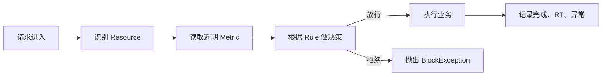
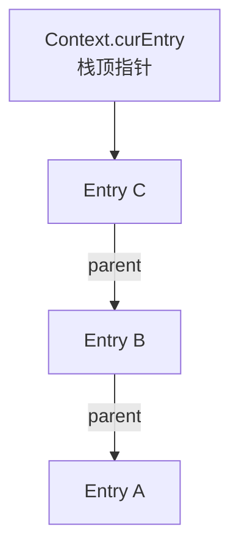
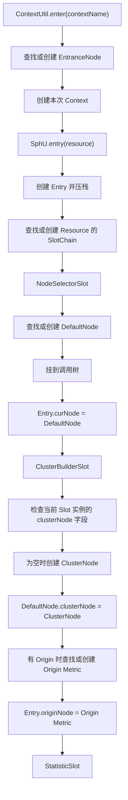
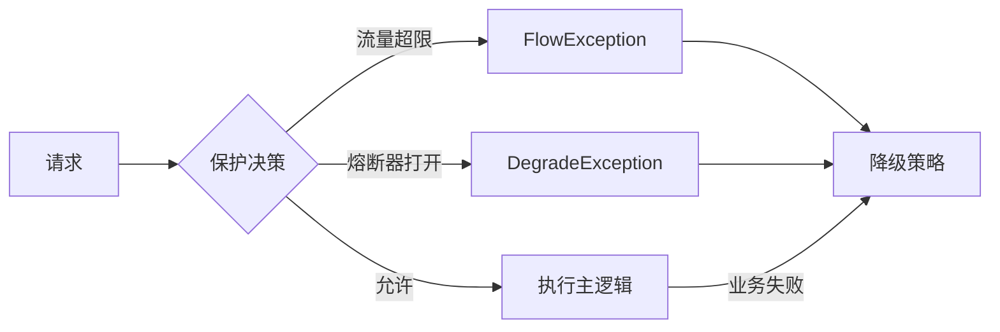

## 1. 背景

阅读 Sentinel 源码时，一个持续出现的困惑是：限流的核心看起来只是“责任链 + 滑动窗口计数器”，为什么实现中又出现了 `Context`、`Entry`、`EntranceNode`、`DefaultNode`、`ClusterNode`、Origin Node，以及多个含义不直观的 Slot？

这篇笔记整理当前阶段的理解，重点回答三个问题：

1. Sentinel 为了哪些功能引入这些概念？
2. 这些对象在一次请求中何时创建、如何关联、各自维护什么？
3. 哪些复杂度来自必要功能，哪些更像历史演进留下的抽象和命名问题？

本文依据当前仓库 `sentinel-core` 源码整理。关于“如果重新设计应该怎样拆分”的内容属于个人评估，不是 Sentinel 官方设计结论。

## 2. 先建立高层模型

Sentinel 可以先理解为一个嵌入应用进程的实时流量决策引擎：



它需要四类基础能力：

| 问题 | Sentinel 中的主要对象 |
| --- | --- |
| 保护谁 | `ResourceWrapper` |
| 表示本次调用 | `Entry` |
| 保存近期运行指标 | 各类 `Node` |
| 根据规则做决策 | 各类 `Rule` 和 `ProcessorSlotChain` |

更准确的简化不是“责任链 + 一个计数器”，而是：

> 责任链 + 多个统计维度的滑动窗口计数器 + 一棵进程内的长期调用关系树。

其中调用树不是普通限流的必要条件，主要服务于 Context 维度统计、链路流控和 Sentinel 自带的树形观测。

## 3. Context 与 Entry：一次调用中的栈

### 3.1 Context 是栈容器，不是完整 Trace

`Context` 通过 `ThreadLocal` 绑定到当前线程，主要保存：

```text
Context
├── name：调用入口分组名称
├── origin：调用方标识
├── entranceNode：该 Context name 对应的长期入口节点
└── curEntry：当前 Entry，也就是栈顶指针
```

关键源码：

- `sentinel-core/src/main/java/com/alibaba/csp/sentinel/context/Context.java`
- `sentinel-core/src/main/java/com/alibaba/csp/sentinel/context/ContextUtil.java`

在典型同步 Web 请求中，可以近似理解为“一次请求一个 Context 对象”。不过，同名 Context 对象会共享同一个 `EntranceNode`。

它与 Trace Context 相似的地方是都能表达嵌套调用；不同之处是 Sentinel Context 没有 `traceId`、`spanId` 和跨进程传播协议，主要用于本地流量治理。

### 3.2 Entry 是一次资源调用

`Entry` 表示某一次受保护调用的生命周期：

```text
进入 Resource
→ 创建 Entry
→ 执行规则检查
→ 执行业务
→ Entry.exit()
```

`CtEntry` 构造时会压栈：

```java
this.parent = context.getCurEntry();
context.setCurEntry(this);
```

退出时恢复父 Entry：

```java
context.setCurEntry(parent);
```

因此：



`Context` 不是栈顶本身，`Context.curEntry` 才是栈顶指针；`Entry.parent` 构成调用栈。

## 4. 先按 Metric 维度理解各种 Node

Sentinel 的 `Node` 接口主要定义 QPS、RT、异常数、并发数等指标读写能力。它更像 `MetricSource`，并不严格表示树节点。

### 4.1 四种统计维度

| 源码称呼 | 实际维度 | 回答的问题 |
| --- | --- | --- |
| `EntranceNode` | `ContextName` | 这类入口的总体流量是多少？ |
| `DefaultNode` | `ContextName × Resource` | 某类入口中的这个资源有多少流量？ |
| `ClusterNode` | `Resource` | 这个资源跨所有 Context 的总流量是多少？ |
| Origin Node | `Resource × Origin` | 某个调用方访问这个资源的流量是多少？ |

其中 Origin Node 没有独立类型，实际只是 `ClusterNode.originCountMap` 中的 `StatisticNode`。

可以把源码命名替换成下面这组脑内别名：

| 源码名称 | 更接近职责的名字 |
| --- | --- |
| `Node` | `MetricSource` |
| `StatisticNode` | `RollingMetrics` |
| `DefaultNode` | `ContextResourceMetrics` / `InvocationTreeNode` |
| `ClusterNode` | `ResourceGlobalMetrics` |
| Origin Node | `CallerMetrics` |
| `EntranceNode` | `ContextGroupRoot` |

### 4.2 “Cluster”不是分布式集群

`ClusterNode` 默认只是当前 JVM 内某个 Resource 的总指标：

```text
DefaultNode(web, queryUser)       80 QPS ──┐
                                          ├── ClusterNode(queryUser) 100 QPS
DefaultNode(scheduler, queryUser) 20 QPS ──┘
```

这里的 Cluster 表示把同一资源在不同 Context 中的指标聚合起来，不是集群限流中的服务器集群。

## 5. Node 的初始化与关联

Node 不是每次请求全部重新创建，而是按不同维度懒创建并长期复用。

### 5.1 生命周期

| 对象 | 创建时机 | 生命周期 |
| --- | --- | --- |
| `Context` | 每次入口调用 | 请求级 |
| `Entry` | 每次 `SphU.entry()` | 单次资源调用 |
| `EntranceNode` | 第一次遇到 Context name | 长期复用 |
| `ProcessorSlotChain` | 第一次遇到 Resource | 长期复用 |
| `DefaultNode` | 第一次遇到 `Resource × ContextName` | 长期复用 |
| `ClusterNode` | 第一次遇到 Resource | 长期复用 |
| Origin `StatisticNode` | 第一次遇到 `Resource × Origin` | 长期复用 |

### 5.2 三层缓存

```text
ContextUtil.contextNameNodeMap
└── ContextName → EntranceNode

CtSph.chainMap
└── Resource → ProcessorSlotChain

Resource 专属 SlotChain
├── NodeSelectorSlot
│   └── ContextName → DefaultNode
└── ClusterBuilderSlot
    └── clusterNode → 当前 Resource 的 ClusterNode
        └── originCountMap
            └── Origin → StatisticNode
```

`NodeSelectorSlot` 内部虽然只用 `ContextName` 作为 Map key，但 Resource 已经隐含在外层的资源专属 Slot Chain 中，因此完整维度仍然是 `Resource × ContextName`。

### 5.3 初始化顺序



需要特别澄清：

- `ClusterBuilderSlot` 处理请求时不是每次从全局 Map 查询 `ClusterNode`，而是先读当前资源专属 Slot 实例的 `clusterNode` 字段。
- 静态 `clusterNodeMap` 主要是全局索引，供其他组件按 Resource 主动查询。
- `DefaultNode` 创建时 `clusterNode` 还是 `null`，在后续 `ClusterBuilderSlot` 中才绑定。
- `StatisticSlot` 排在绑定之后，因此能够通过 `DefaultNode` 级联更新 `ClusterNode`。这也是 Slot 间的隐式顺序依赖。

## 6. 调用树如何构建

调用树通过 Entry 栈推导，而不是通过 Trace 数据生成。

### 6.1 构树规则

`NodeSelectorSlot` 创建 `DefaultNode` 后执行：

```java
context.getLastNode().addChild(node);
```

`getLastNode()` 的名字容易误解，它实际返回：

```text
当前 Entry 有父 Entry
→ 返回父 Entry.curNode

当前 Entry 没有父 Entry
→ 返回 Context.entranceNode
```

更准确的名字应当是：

```java
getParentNodeOfCurrentEntry()
```

假设调用为：

```text
A → B → C
```

Entry 栈：

```text
Context.curEntry
└── Entry C
    └── parent → Entry B
        └── parent → Entry A
```

Node 树：

```text
EntranceNode
└── DefaultNode A
    └── DefaultNode B
        └── DefaultNode C
```

第一个 Entry 不是 `EntranceNode`。第一个 Entry 对应的仍然是 `DefaultNode`，只是因为它没有父 Entry，所以挂在 `EntranceNode` 下面。

### 6.2 它不等同于精确 Trace

这棵树按 `Resource × ContextName` 长期复用，不是每个请求单独创建。假设第一次出现：

```text
A → B
```

后来又出现：

```text
C → B
```

同一个 Context name 下的 B 通常复用原来的 `DefaultNode`，不会像 Trace 一样为第二条路径创建新的 Span Node。因此它更接近长期统计关系树，而不是每次请求的精确调用树。

个人评估：如果系统已经使用专业 Trace，并且不需要 Sentinel 的链路流控和 `/tree` 观测，这棵调用树的价值比较有限。

## 7. Metric 的写入与存储

`StatisticSlot` 分两个时间点维护指标：

```text
entry：记录准入结果
exit：记录执行结果
```

### 7.1 entry 阶段

它先调用 `fireEntry()` 执行后续规则 Slot：

```java
try {
    fireEntry(...);

    node.increaseThreadNum();
    node.addPassRequest(count);
} catch (BlockException e) {
    node.increaseBlockQps(count);
    throw e;
}
```

因此：

| 结果 | 更新 |
| --- | --- |
| 后续规则全部通过 | `pass += 1`，`thread += 1` |
| 后续规则抛出 `BlockException` | `block += 1` |

`pass` 表示已经被 Sentinel 放行，不表示业务成功完成。

### 7.2 exit 阶段

业务结束并调用 `Entry.exit()` 时：

```text
completed += 1
RT += 本次耗时
thread -= 1
存在业务异常时 exception += 1
```

源码中的 `success` 更接近 completed：即使业务异常，也会记录完成数，同时增加 exception。

### 7.3 一次调用会更新哪些 Metric

假设：

```text
ContextName = web
Resource = queryUser
Origin = mobile-app
EntryType = IN
```

一次放行会更新：

```text
DefaultNode(web, queryUser)
ClusterNode(queryUser)
OriginMetrics(queryUser, mobile-app)
Constants.ENTRY_NODE
```

其中：

- `DefaultNode` 自身更新后级联更新 `ClusterNode`。
- Origin Metric 由 `StatisticSlot` 单独更新。
- `Constants.ENTRY_NODE` 只针对 `EntryType.IN` 更新。

### 7.4 StatisticNode 为什么有秒级和分钟级两套统计

`StatisticNode` 为同一组事件同时维护两套滑动统计：

| 字段 | 默认结构 | 主要用途 |
| --- | --- | --- |
| `rollingCounterInSecond` | 1 秒、2 个 Bucket，每个 500 ms | QPS、平均 RT、规则判断 |
| `rollingCounterInMinute` | 60 秒、60 个 Bucket，每个 1 秒 | 最近一分钟汇总、监控明细 |

源码初始化关系：

```java
rollingCounterInSecond =
    new ArrayMetric(SAMPLE_COUNT, INTERVAL_IN_MS);

rollingCounterInMinute =
    new ArrayMetric(60, 60 * 1000, false);
```

同一个事件会同时写入两套统计，例如：

```text
pass
├── rollingCounterInSecond
└── rollingCounterInMinute

block / RT / exception
└── 同样同时写入两套统计
```

但读取用途不同：

- `passQps()`、`blockQps()`、`avgRt()` 等主要读取秒级窗口；
- `totalRequest()`、`totalPass()`、`totalException()` 和分钟明细读取分钟窗口；
- `curThreadNum` 是独立的当前值，不属于滑动窗口。

这里的 `totalRequest()` 容易误解：它不是进程启动以来的累计总数，而是最近一分钟窗口内的总数。

### 7.5 ArrayMetric 与 LeapArray 是什么关系

两者不是两套计数器，而是上下两层：

```text
StatisticNode
└── ArrayMetric
    └── LeapArray<MetricBucket>
        └── AtomicReferenceArray<WindowWrap<MetricBucket>>
```

职责分别是：

| 对象 | 职责 |
| --- | --- |
| `ArrayMetric` | 提供 `addPass()`、`pass()`、`avgRt()` 等指标语义 |
| `LeapArray` | 根据时间定位、创建和复用环形 Bucket |
| `WindowWrap` | 描述某个数组槽当前代表的时间段 |
| `MetricBucket` | 保存 pass、block、RT、exception 等实际计数 |

因此可以把它们理解为：

```text
ArrayMetric = 指标操作门面
LeapArray   = 时间桶存储引擎
```

`ArrayMetric` 把业务上的“增加一次 pass”转换为：

```text
找到当前 Bucket
→ 取出 MetricBucket
→ 增加 PASS 计数
```

### 7.6 统一 interval、window、bucket、sample 术语

这部分源码的命名确实容易混淆。更稳定的心智模型是：

```text
一个滑动统计区间（horizon）
└── N 个固定对齐的时间桶（bucket）
```

例如：

```text
最近 1 秒
├── [0 ms,   500 ms)
└── [500 ms, 1000 ms)
```

对应源码字段：

| 源码名称 | 实际含义 | 更直观的名称 |
| --- | --- | --- |
| `intervalInMs` | 整个统计区间长度 | `horizonInMs` |
| `sampleCount` | 区间内 Bucket 数量 | `bucketCount` |
| `windowLengthInMs` | 单个 Bucket 的宽度 | `bucketLengthInMs` |
| `WindowWrap` | 环形数组中的一个时间桶槽位 | `BucketSlot` |
| `currentWindow()` | 找到当前时间桶 | `currentBucket()` |

所以源码中的 `window` 大多实际指 Bucket，而不是“由多个 Bucket 组成的整个滑动窗口”。

`sampleCount` 也不是对请求做抽样，而是把时间区间切成多少份：

```text
bucketLength = interval / sampleCount
```

Sentinel 实现的是“固定对齐 Bucket + 最近若干 Bucket 聚合”的近似滑动窗口。Bucket 越小，边界误差越小，但轮转和聚合成本也越高。

### 7.7 时间戳如何映射到环形 Bucket

给定：

```text
intervalInMs  = 1000
sampleCount   = 2
bucketLength  = 500
timestamp     = 1300
```

计算过程是：

```text
bucketSequence = 1300 / 500 = 2
bucketIndex    = 2 % 2      = 0
bucketStart    = 1300 - 1300 % 500 = 1000
```

因此数组下标 0 当前代表：

```text
[1000 ms, 1500 ms)
```

这里有三个要点：

1. 时间戳既用于确定时间桶的起点，也用作环形数组游标；
2. Bucket 按 Unix epoch 的整数倍对齐，与时区无关，也不从应用启动时刻开始对齐；
3. 数组下标会复用，所以必须通过 `windowStart` 判断槽位属于当前代还是旧代。

对 interval 的真正要求是：

```text
intervalInMs % sampleCount == 0
```

因为 Sentinel 使用整数毫秒保存 Bucket 宽度。例如：

| 配置 | Bucket 宽度 | 是否可用 |
| --- | ---: | --- |
| interval=1000，count=5 | 200 ms | 是 |
| interval=1000，count=3 | 无法整除 | 否 |
| interval=1200，count=4 | 300 ms | 是 |

所以 300 ms 本身没有问题；问题只在于总区间能否被 Bucket 数量整除。

### 7.8 WindowWrap.windowLength 是否冗余

`WindowWrap` 当前包含：

```java
class WindowWrap<T> {
    private final long windowLengthInMs;
    private long windowStart;
    private T value;
}
```

从当前 `LeapArray` 的固定宽度模型看，`windowLengthInMs` 确实是冗余状态：

- Bucket 宽度已经保存在所属 `LeapArray` 中；
- 同一个 `LeapArray` 创建的所有 `WindowWrap` 宽度都相同；
- 槽位复用只需要更新 `windowStart` 和 `value`。

它保留在 `WindowWrap` 中的直接作用，是让对象可以脱离 `LeapArray` 独立判断：

```java
windowStart <= time && time < windowStart + windowLength
```

个人设计判断：如果 `WindowWrap` 只允许被固定宽度的 `LeapArray` 管理，更干净的模型可以是：

```java
class BucketSlot<T> {
    private long startTime;
    private T value;
}
```

结束时间统一由所属数组的 `bucketLength` 计算。这样既减少重复状态，也避免外部构造出“数组按 500 ms 定位、槽位却自称 300 ms”的不一致对象。

不过 `windowStart` 不能删。环形数组会反复复用同一个下标，必须靠它区分该槽位当前代表哪一段时间。

### 7.9 LeapArray 的子类不是多套滑动窗口算法

当前仓库中可以找到 8 个直接继承 `LeapArray` 的实现。它们复用的是同一套时间定位、环形复用和有效 Bucket 聚合算法，主要区别在于：

```text
1. 每个 Bucket 保存什么数据；
2. 创建新 Bucket 时如何初始化；
3. 复用旧 Bucket 时如何清空；
4. 是否需要处理未来流量预占。
```

可以按使用场景分为四组：

```text
LeapArray<T>
│
├── 普通资源 Metric
│   ├── BucketLeapArray
│   ├── OccupiableBucketLeapArray
│   └── FutureBucketLeapArray
│
├── 单值计数
│   └── UnaryLeapArray
│
├── 熔断器专用统计
│   ├── SlowRequestLeapArray
│   └── SimpleErrorCounterLeapArray
│
└── 集群流控统计
    ├── ClusterMetricLeapArray
    └── ClusterParameterLeapArray
```

| 实现 | Bucket 数据 | 实际场景 |
| --- | --- | --- |
| `BucketLeapArray` | `MetricBucket` | 普通资源的多指标统计；当前主要承载 `StatisticNode` 的分钟窗口 |
| `OccupiableBucketLeapArray` | `MetricBucket` | 支持高优先级请求预占未来配额；当前承载秒级窗口 |
| `FutureBucketLeapArray` | `MetricBucket` | 保存未来时间片的预约量，是 `OccupiableBucketLeapArray` 的辅助数组 |
| `UnaryLeapArray` | `LongAdder` | 集群服务端按 namespace 统计总请求 QPS |
| `SlowRequestLeapArray` | `slowCount + totalCount` | 慢调用比例熔断 |
| `SimpleErrorCounterLeapArray` | `errorCount + totalCount` | 异常比例、异常数熔断 |
| `ClusterMetricLeapArray` | `ClusterMetricBucket` | Token Server 的资源流量统计和下一 Bucket 预占 |
| `ClusterParameterLeapArray` | `CacheMap<参数值, 计数器>` | 集群热点参数统计，每个 Bucket 内使用有界 LRU Map |

几个容易混淆的点：

- `UnaryLeapArray` 的 `Unary` 表示每个 Bucket 只有一个数值，更直观的名字可能是 `SingleCounterLeapArray`；
- `BucketLeapArray` 实际特征是 `T = MetricBucket`，更准确的名字是 `MetricBucketLeapArray`；
- 两个熔断器实现都使用 `sampleCount = 1`，因此一个统计周期内只有一个 Bucket，更接近周期滚动统计，而不是多 Bucket 的精细滑动窗口；
- `FutureBucketLeapArray` 不独立提供普通指标，它只为未来预约服务。

### 7.10 预占是“预约未来配额 + 当前线程等待”

预占不是提前执行请求，而是：

```text
高优先级请求当前超限
→ 判断旧 Bucket 何时滑出统计区间
→ 如果短时间内会释放容量
→ 在未来 Bucket 预约 PASS
→ 当前线程等待
→ 等待结束后继续执行
```

本地预占只在以下条件同时满足时触发：

```text
DefaultController 判断已经超过阈值
AND prioritized = true
AND FlowRule.grade = QPS
AND 能在 occupyTimeout 内找到未来容量
```

高优先级标记来自：

```java
SphU.entryWithPriority("resource")
```

主要调用链是：

```text
DefaultController.canPass()
→ StatisticNode.tryOccupyNext()
→ 逐个扣除即将滑出窗口的旧 Bucket
→ 计算最早可用的未来时间
→ StatisticNode.addWaitingRequest()
→ OccupiableBucketLeapArray.addWaiting()
→ FutureBucketLeapArray 写入未来 PASS
→ Thread.sleep(waitInMs)
```

容量判断近似为：

```text
currentPass
+ currentBorrow
+ acquireCount
- 到目标时间将滑出的 windowPass
<= interval 内允许的 maxCount
```

`currentBorrow` 必须参与计算，否则多个并发请求可能重复预约同一份未来容量。

`OccupiableBucketLeapArray` 内部实际上有两组时间桶：

```text
OccupiableBucketLeapArray
├── 主数组：已经发生的真实 PASS、BLOCK、RT 等指标
└── FutureBucketLeapArray：未来时间点已经预约的 PASS
```

当真实时间进入被预约的 Bucket 时，`newEmptyBucket()` 或 `resetWindowTo()` 会读取预约 Bucket，并把预约的 PASS 转入主数组。这样等待后的请求不会被漏计，也不会等到通过时再从零开始竞争同一份容量。

本地实现还使用 `PriorityWaitException` 作为内部控制流：

```text
预约时已经登记 PASS
→ sleep 完成
→ 抛 PriorityWaitException
→ StatisticSlot 将其视为通过
→ 只增加线程数，不再重复 addPassRequest()
```

因此它不是业务失败，而是“已经等待完成，不要重复计数”的信号。更准确的类型名称可能是 `PriorityWaitCompletedSignal`。

集群模式表达相同语义，但没有复用本地的 `FutureBucketLeapArray`：

```text
Token Server
→ ClusterMetric.tryOccupyNext()
→ ClusterMetricLeapArray.occupyCounter 暂存预约量
→ 返回 SHOULD_WAIT + waitInMs
→ 客户端 sleep
→ 新 Bucket 轮转时转入真实 ClusterMetricBucket
```

这说明本地预占和集群预占是两个平行实现，不是一套统一调度机制。

## 8. Constants.ENTRY_NODE

`Constants.ENTRY_NODE` 是整个 JVM 所有入口流量共享的指标：

```java
new ClusterNode("__total_inbound_traffic__", ...)
```

它的维度不是 Resource，而是：

```text
应用内所有 EntryType.IN Resource 的总和
```

例如：

```text
GET:/users       100 QPS
POST:/orders      50 QPS
GET:/products    200 QPS
```

则：

```text
Constants.ENTRY_NODE = 350 QPS
```

它主要供 `SystemRuleManager` 检查应用整体入口 QPS、并发数、平均 RT 等系统保护指标。

它与 `EntranceNode` 不同：

| 对象 | 维度 |
| --- | --- |
| `EntranceNode` | 一个 Context name |
| 普通 `ClusterNode` | 一个 Resource |
| `Constants.ENTRY_NODE` | 应用内全部 `EntryType.IN` Resource |

更合适的名字是 `GlobalInboundMetrics`。

## 9. 默认 Slot 的真实职责与反直觉命名

默认 Slot Chain 可以分成两组：

```text
指标准备与观察
├── NodeSelectorSlot
├── ClusterBuilderSlot
├── LogSlot
└── StatisticSlot

治理决策
├── AuthoritySlot
├── SystemSlot
├── FlowSlot
├── DegradeSlot
└── DefaultCircuitBreakerSlot
```

| 原名 | 实际职责 | 更易懂的名字 |
| --- | --- | --- |
| `NodeSelectorSlot` | 解析或创建 `DefaultNode`，构树并绑定 Entry | `ContextMetricResolver` |
| `ClusterBuilderSlot` | 创建资源总 Metric、管理 Origin Metric 并完成绑定 | `ResourceMetricBinder` |
| `LogSlot` | 捕获并记录后续 Slot 的拒绝异常 | `RejectionLoggingSlot` |
| `StatisticSlot` | 维护准入和完成阶段指标 | `MetricRecordingSlot` |
| `AuthoritySlot` | 基于 Origin 做黑白名单检查 | `OriginAccessControlSlot` |
| `SystemSlot` | 根据应用整体指标做过载保护 | `SystemProtectionSlot` |
| `FlowSlot` | 执行流控、限流和流量整形 | `FlowControlSlot` |
| `DegradeSlot` | 执行显式配置的熔断器 | `ConfiguredCircuitBreakerSlot` |
| `DefaultCircuitBreakerSlot` | 执行 `resource="*"` 的通配默认熔断规则 | `WildcardCircuitBreakerSlot` |

`NodeSelectorSlot` 中的 Selector 只体现在：

```java
map.get(context.getName())
```

但它实际还负责创建、缓存、构树和绑定。

`ClusterBuilderSlot` 中的 Cluster 不是分布式集群，Builder 也没有覆盖其绑定和 Origin Registry 职责。

`DegradeSlot` 实际执行熔断，不负责返回缓存、默认值或备用服务。

## 10. 限流、熔断与降级

### 10.1 限流、熔断与降级的关系

限流和熔断属于同一个决策层面：

```text
本次请求是否允许执行主逻辑？
```

但判断依据不同：

| 机制 | 关注点 | 典型拒绝异常 |
| --- | --- | --- |
| 限流 | 当前流量是否超过容量 | `FlowException` |
| 熔断 | 被调用资源近期是否不健康 | `DegradeException` |
| 调用方控制 | Origin 是否允许访问 | `AuthorityException` |
| 系统保护 | 应用整体是否过载 | `SystemBlockException` |

降级属于另一个正交层面：

```text
主逻辑不能执行后，返回什么？
```

例如：

- 返回缓存；
- 返回默认值；
- 调用备用服务；
- 只返回部分数据；
- 明确返回系统繁忙。

限流和熔断都可以触发降级：



Sentinel 把熔断相关类型命名成 `DegradeRule`、`DegradeSlot`、`DegradeException`，容易把熔断机制和降级策略混在一起。更准确的命名分别应是 `CircuitBreakerRule`、`CircuitBreakerSlot` 和 `CircuitBreakerOpenException`。

### 10.2 TrafficShapingController 是单条 FlowRule 的运行时策略

这里的 `Controller` 不是 MVC Controller，而是：

> 根据当前 Metric 和 FlowRule，决定本次请求如何准入或整形的算法对象。

`FlowRule`、`Node` 和 `TrafficShapingController` 的关系是：

```text
FlowRule
├── resource / strategy：限制谁、读取哪个 Node
├── grade / count：限制什么、阈值是多少
└── controlBehavior：超限前后采用哪种流量整形行为
                          │
                          ▼
               TrafficShapingController
                          ▲
                          │
Node ───────── 提供 passQps、curThreadNum 等运行时 Metric
```

规则加载时，`FlowRuleUtil.buildFlowRuleMap()` 会为每条规则创建运行时 Controller：

```java
TrafficShapingController controller = generateRater(rule);
rule.setRater(controller);
```

请求检查时：

```text
FlowRuleChecker
→ 根据 FlowRule.strategy 选择 Node
→ rule.getRater().canPass(selectedNode, acquireCount, prioritized)
→ true 表示通过，false 表示拒绝
```

`controller`、`rater` 两套名称同时存在，是一次没有彻底完成的命名演进。按实际职责，更直接的名称是：

```text
FlowAdmissionPolicy
RateLimitAlgorithm
TrafficShapingStrategy
```

### 10.3 四种 Controller 的场景

`FlowRule.controlBehavior` 决定具体实现：

| controlBehavior | 实现 | 主要语义 |
| --- | --- | --- |
| `DEFAULT` | `DefaultController` | 当前统计未超限则通过，否则立即拒绝；高优请求是预占例外 |
| `WARM_UP` | `WarmUpController` | 从较低阈值逐渐提升到配置阈值，避免冷系统突然承受满流量 |
| `RATE_LIMITER` | `ThrottlingController` | 按固定间隔均匀放行，等待超过 `maxQueueingTimeMs` 才拒绝 |
| `WARM_UP_RATE_LIMITER` | `WarmUpRateLimiterController` | 同时进行预热和匀速排队 |

`ThrottlingController` 不依赖 `Node` 的滑动 QPS 决定每次放行，而是维护：

```java
AtomicLong latestPassedTime;
```

假设阈值是 10 QPS，则请求之间的目标间隔约为：

```text
1000 ms / 10 = 100 ms
```

每个请求计算自己的预计通过时间：

```text
expectedTime = latestPassedTime + requestCost
waitTime = expectedTime - now
```

若 `waitTime` 没有超过最大排队时间，就更新 `latestPassedTime` 并阻塞当前线程；否则返回 `false`。所以它本质上是一个漏桶式的同步匀速排队器。

预占与 `ThrottlingController` 都会等待，但语义不同：

| 机制 | 触发方式 | 等待依据 |
| --- | --- | --- |
| 预占 | `DefaultController` 下的高优先级请求已经超限 | 旧 Bucket 何时滑出并释放容量 |
| `ThrottlingController` | 规则显式配置为匀速排队 | 上一个请求的计划通过时间 |

### 10.4 对阻塞式预占和排队的设计判断

源码已确认：

- `DefaultController` 预占通过 `Thread.sleep(waitInMs)` 阻塞当前线程；
- `ThrottlingController` 同样会在 `canPass()` 内等待；
- 本地预占默认最大等待时间为 500 ms，且不能超过秒级统计区间；
- 本地实现忽略 `InterruptedException`，并使用 `PriorityWaitException` 表示正常通过路径；
- `StatisticNode.tryOccupyNext()` 的注释明确承认，高并发下读取到的 `currentPass` 可能落后，从而发生超借。

个人设计判断：

> “允许少量高优请求等待未来容量”有窄场景价值，但把它实现为限流组件内部阻塞业务线程，不适合作为在线 HTTP/RPC 服务的通用方案。

主要问题不是等待语义本身，而是 `canPass()` 看起来像纯判断，实际同时负责：

```text
准入判断
配额预约
运行时状态修改
业务线程阻塞
通过指标协调
异常控制流
```

这会隐藏延迟和线程占用，也让限流本应提供的过载保护变成新的线程堆积来源。

对典型在线服务，更清晰的方案通常是：

```text
服务端 fail-fast
→ 返回明确限流状态和可选 Retry-After
→ 调用方只对幂等请求进行有上限的退避重试
→ 使用指数退避、随机抖动、最大次数和总超时预算
```

简单的“失败后立即重试”同样不可取，因为它可能形成重试风暴。对需要排队的场景，更适合在网关、消息队列或异步调度层完成，而不是挂起有限的业务工作线程。

如果重新设计接口，可以把计算和执行分开：

```java
AdmissionDecision decide(...);

// Pass
// Reject
// Delay(duration)
```

限流算法只返回决策，上层再按运行模型选择同步等待、异步恢复或向调用方返回重试信息。这样不会把 `Thread.sleep()` 隐藏在名为 `canPass()` 的布尔方法中。

## 11. BlockException 异常树

```text
Exception
└── BlockException
    ├── FlowException
    ├── DegradeException
    ├── AuthorityException
    ├── SystemBlockException
    └── ParamFlowException
```

`BlockException` 的统一语义是：

> 请求在进入业务代码前，被 Sentinel 的治理规则拒绝。

它不属于业务异常。`StatisticSlot` 会把它计入 block，而不是 exception。

`BlockException.fillInStackTrace()` 直接返回自身，不生成完整调用栈，适用于高频拒绝场景，避免大量构造堆栈的成本。

## 12. DefaultCircuitBreakerSlot 与默认规则缓存

### 12.1 它不是 DegradeSlot 的默认实现

两个 Slot 处理不同规则来源：

```text
DegradeSlot
→ 具体 Resource 的显式熔断规则

DefaultCircuitBreakerSlot
→ resource="*" 的通配默认熔断规则
```

显式规则优先。如果 `DegradeRuleManager.hasConfig(resource)` 为 true，`DefaultCircuitBreakerSlot` 会跳过。

源码历史显示，这项能力由 2022 年的提交 `Add default circuit breaker rule support (#2232)` 单独加入。因此没有对称的 `DefaultFlowSlot`：这是后续增加的一项熔断功能，不是 Slot 架构中天然存在的“默认实现”层次。

### 12.2 规则从哪里来

默认规则通过以下入口加载：

```java
DefaultCircuitBreakerRuleManager.loadRules(rules);
```

或注册动态 Property：

```java
DefaultCircuitBreakerRuleManager.register2Property(property);
```

Sentinel Core 默认不会凭空生成一组默认熔断阈值；没有上层主动加载时，这个 Slot 不生效。

### 12.3 缓存与更新

运行时缓存结构：

```text
ResourceName → List<CircuitBreaker>
```

更新链路：

```text
loadRules(newRules)
→ SentinelProperty.updateValue()
→ PropertyListener.configUpdate()
→ reloadFrom(newRules)
→ 重建并整体替换 circuitBreakers Map
```

已经出现过的 Resource 会在更新时重建；尚未出现的 Resource 在第一次访问时按照最新规则懒创建；规则清空时 rules 和缓存全部清空。

### 12.4 当前实现中值得注意的边界

源码似乎希望复用规则未变化的旧熔断器，以保留状态：

```java
getExistingSameCbOrNew(rule)
```

但该方法使用 `rule.getResource()` 查询缓存。默认规则的 Resource 固定为 `"*"`，而缓存通常以实际 Resource name 为 key。因此按当前代码看，只要默认规则集合发生变化，已缓存资源的 CircuitBreaker 基本会重新创建，原状态和统计窗口会被重置。

另外，`DynamicSentinelProperty` 使用 `oldValue.equals(newValue)` 判断变化。如果原地修改同一个 List 或 Rule 对象再调用 `loadRules()`，更新可能无法触发。更安全的方式是传入新的规则快照。

以上两点是基于当前源码的实现判断，尚未通过专门的运行实验验证。

## 13. 运行状态的生命周期与回收

### 13.1 滑动窗口滚动不等于 Resource 淘汰

`StatisticNode` 内部使用固定长度的环形数组保存时间桶。假设最近一秒分为两个 500ms 的桶：

```text
┌─────────────┬─────────────┐
│ 0~500ms     │ 500~1000ms  │
│ pass = 10   │ pass = 20   │
└─────────────┴─────────────┘
```

时间推进后，过期位置被清空并复用：

```text
┌─────────────┬─────────────┐
│ 1000~1500ms │ 500~1000ms  │
│ pass = 0    │ pass = 20   │
└─────────────┴─────────────┘
```

因此，滚动淘汰的是旧时间段的 pass、block、RT 等数值，不是承载这些数值的对象：

```text
会滚动覆盖：
→ WindowWrap / MetricBucket 中的旧数据

仍然长期驻留：
→ Resource
→ ProcessorSlotChain
→ DefaultNode
→ ClusterNode
→ Origin StatisticNode
```

一个每天只访问一次的 Resource，其滑动窗口大部分时间都是空的，但 Slot Chain 和各类 Node 仍可能一直被注册表引用。

### 13.2 当前核心状态没有统一 LRU

当前几个主要注册表的策略如下：

| 状态 | 当前策略 | 超限或清理行为 |
| --- | --- | --- |
| Resource Slot Chain | `MAX_SLOT_CHAIN_SIZE = 6000` | 超限返回 `null`，新 Resource 跳过规则检查 |
| Context name | `MAX_CONTEXT_NAME_SIZE = 2000` | 超限使用 `NullContext`，不执行规则检查 |
| `ClusterNode` | 随 Resource 长期注册 | 无生产级 LRU |
| `DefaultNode` | `Resource × ContextName` 长期复用 | 无 LRU |
| Origin Metric | `ClusterNode.originCountMap` | 无容量上限和 LRU |
| `Constants.ENTRY_NODE` | 静态单例 | JVM 生命周期 |
| 热点参数值 Metric | 有界 `ConcurrentLinkedHashMap` | 达到容量后淘汰 |

Resource 超限路径位于 `CtSph.lookProcessChain()`：

```java
if (chainMap.size() >= Constants.MAX_SLOT_CHAIN_SIZE) {
    return null;
}
```

上层拿到 `null` 后创建一个没有 Chain 的 Entry，请求直接通过。因此这不是 LRU，而是：

```text
固定上限
+ 先到先得
+ 超限 fail-open
```

这意味着一个很久以前只访问过一次的 Resource 可以永久占位，而后来出现的重要 Resource 可能因超过 6000 而失去保护。该实现依赖一个重要前提：Resource name 必须稳定、低基数，不能包含 userId、requestId 等动态值。

Origin Metric 的风险更直接。其完整规模近似：

```text
Resource 数量 × Origin 数量
```

核心实现没有淘汰，所以 Origin 应使用稳定的上游应用名，而不应使用高基数用户或设备标识。

### 13.3 Metric 在什么条件下可以安全过期

对于纯滑动窗口 Metric，空闲后从 0 重新开始通常是正确语义。

假设：

```text
最长有效统计窗口 = 1 分钟
Resource 已连续 5 分钟没有请求
```

此时最近一分钟的真实流量本来就是 0。删除 Metric 后，下一次请求创建新 Metric：

```text
passQps = 0
blockQps = 0
currentThread = 0
```

并没有丢失仍然有效的历史数据。

可以将安全回收条件概括为：

```text
空闲时间 > 所有相关 Metric 的最大统计窗口
AND 当前活跃调用数 = 0
→ Metric 可以过期
```

空闲阈值应覆盖最长统计窗口并留出缓冲，例如：

```text
最长窗口 = 1 分钟
expireAfterAccess = 5 分钟
```

这里需要记录一处认识修正：

> 显式 FlowRule 的配置需要保留，但对应 Resource Metric 不必因此永久保留。

Rule 与 Metric 应拥有不同生命周期：

```text
FlowRule
→ 配置生命周期，直到规则被删除

Resource Metric
→ 统计窗口生命周期，长期空闲后可以回收
```

下一次请求到来时，可以先重新创建从 0 开始的 Metric，再读取仍然存在的 FlowRule 做检查。

唯一需要保证的是：有规则的 Resource 必须能够重新创建 Metric，不能因为注册表容量已满而返回 `null` 并跳过治理。

### 13.4 不能把所有 Resource 状态使用同一个过期时间

Resource 相关状态不只有 Metric：

| 状态 | 合理生命周期 |
| --- | --- |
| FlowRule / DegradeRule | 配置生命周期 |
| 滑动窗口 Metric | 最大统计窗口 + 空闲缓冲 |
| CircuitBreaker | 熔断状态机和规则生命周期 |
| Warm Up Controller | 规则或预热算法状态生命周期 |
| 匀速排队 Controller | 排队和最近通过时间的有效周期 |
| Slot Chain | 无状态化后可共享或按需重建 |

如果一个 `ResourceState` 同时包含 CircuitBreaker，不能只根据“一分钟 Metric 已过期”就删除整个对象。熔断器可能处于 OPEN 状态，并配置了更长的 `timeWindow`；提前删除会让下一次请求从 CLOSED 重新开始，相当于提前解除熔断。

Warm Up Controller 也可能维护 stored tokens 和最近填充时间。空闲后是否重新预热是流控语义，不是普通 Metric 淘汰可以自动决定的。

因此，更清楚的拆分是：

```text
RuleRegistry
→ 配置生命周期

MetricRegistry
→ 统计窗口生命周期

CircuitBreakerRegistry
→ 状态机生命周期

TrafficControllerRegistry
→ 控制算法生命周期

PolicyChain
→ 尽量无状态并共享
```

### 13.5 是否可以用 Caffeine 或 Guava Cache

成熟缓存库适合承担：

- 并发缓存；
- `expireAfterAccess` 空闲过期；
- `maximumSize` 或 `maximumWeight` 容量控制；
- Removal Listener；
- 按 key 原子加载。

但不能只把：

```java
Map<ResourceWrapper, ProcessorSlotChain>
```

替换成：

```java
Cache<ResourceWrapper, ProcessorSlotChain>
```

因为当前同一 Resource 的状态散落在：

```text
CtSph.chainMap
ClusterBuilderSlot.clusterNodeMap
EntranceNode.childList
DefaultNode.clusterNode
DegradeRuleManager
DefaultCircuitBreakerRuleManager
```

只删除 `chainMap` 中的索引，旧 Node 仍可能被调用树和静态 Map 引用，内存未必释放；相同 Resource 再次进入时还可能创建新旧两套 Metric。

更合理的前提是先把同生命周期状态收拢：

```java
class ResourceMetricSet {
    RollingMetrics global;
    Map<String, RollingMetrics> contextMetrics;
    Cache<String, RollingMetrics> originMetrics;
    AtomicInteger activeInvocations;
}
```

然后让缓存管理整个 Metric Set：

```java
Cache<ResourceWrapper, ResourceMetricSet> metrics =
    Caffeine.newBuilder()
        .maximumSize(6_000)
        .expireAfterAccess(Duration.ofMinutes(5))
        .build();
```

对于 Origin Metric，可以在每个 Resource 内继续使用有界 Cache：

```text
Resource
└── Cache<Origin, RollingMetrics>
    ├── maximumSize
    └── expireAfterAccess
```

这种按 Resource 分组只是索引方式，不表示 Global、Context 和 Origin Metric 存在业务父子关系。

根据 Caffeine 当前官方说明，基于时间的过期通常在写操作、偶发读操作或 `cleanUp()` 维护时完成；如需更及时的清理，可以配置 Scheduler。过期条目即使暂时仍计入估算大小，也不会继续对正常读写可见。

当前仓库编译目标是 Java 8。Caffeine 3.x 要求 Java 11 及以上；若保持 Java 8，需要选择 Caffeine 2.x，或者先升级项目的 Java 基线。Guava Cache 也支持 `maximumSize`、`expireAfterAccess` 和 Removal Listener，但对于新设计，个人倾向优先评估 Caffeine。

### 13.6 比单纯 LRU 更合适的策略

纯 LRU 会引入两个问题：

1. 活跃请求仍持有旧状态时，新请求可能创建另一套 Metric，造成统计分裂。
2. 高基数 Resource 可以不断挤掉热点 Resource，使计数器反复归零，从而绕过限流。

更合适的策略是：

```text
空闲超时回收
+ 活跃调用保护
+ 规则与 Metric 分离
+ 容量溢出兜底
```

例如：

```text
Metric 空闲超过 5 分钟
AND activeInvocations == 0
→ 允许回收 Metric

规则仍然存在
→ 下一次请求重建 Metric 后继续执行规则
```

容量达到上限时，也不应简单 fail-open。可以考虑：

```text
有显式规则的新 Resource
→ 优先创建 Metric，回收长期空闲 Metric

无规则的新 Resource
→ 使用可淘汰缓存

仍然无法创建
→ 落入共享 Overflow Metric，并记录告警
```

共享 Overflow Metric 无法提供精确的单 Resource 限流，但至少仍能参与应用级保护，不会像当前逻辑一样完全绕过检查。

以上回收方案属于个人设计推演，尚未在 Sentinel 当前架构中实现或压测。

## 14. 当前设计评估

以下是个人评估，不是源码事实。

### 14.1 调用树可以与流控 Metric 解耦

如果系统已经使用 Trace，并且不需要 Sentinel 的链路流控，可以考虑让 Trace 负责调用拓扑，Sentinel 只保留本地实时 Metric：

```text
Trace
→ 每次请求的精确调用拓扑

MetricRegistry
→ 本地实时滑动窗口

PolicyChain
→ 限流、熔断、授权和系统保护
```

### 14.2 Metric 不应通过 Node 层级表达

逻辑上可以统一成：

```text
(Resource, GLOBAL)
(Resource, CONTEXT, ContextName)
(Resource, ORIGIN, Origin)
(APPLICATION, INBOUND)
```

底层仍可按 Resource 分组存储：

```java
class ResourceMetricSet {
    RollingMetrics global;
    Map<String, RollingMetrics> contextMetrics;
    Map<String, RollingMetrics> originMetrics;
}
```

这里的嵌套只是索引方式，不表示业务父子关系。

### 14.3 Metric Registry、Recorder 和 Policy Chain 应分开

更清楚的职责划分：

```text
MetricRegistry
→ 解析或创建各维度 Metric

MetricRecorder
→ onPass / onBlock / onComplete

PolicyChain
→ 根据 Metric 和 Rule 做决策

InvocationContext
→ 保存本次调用的 Resource、Origin 和生命周期
```

这样可以避免 `NodeSelectorSlot → ClusterBuilderSlot → StatisticSlot` 之间的隐式初始化顺序。

### 14.4 默认规则不必增加新 Slot

`DegradeSlot` 和 `DefaultCircuitBreakerSlot` 可以统一成一个 `CircuitBreakerSlot`，由 Rule Registry 处理优先级：

```text
具体 Resource 规则
→ 存在则使用

否则使用 "*" 通配规则
→ 被排除则不使用
```

默认规则属于规则解析问题，不必提升成新的处理阶段。

## 15. 复习索引

### 15.1 四个核心对象

```text
Resource：保护谁
Entry：本次调用
Metric/Node：近期发生了什么
Slot + Rule：是否允许执行
```

### 15.2 Node 维度

```text
EntranceNode = ContextName
DefaultNode = ContextName × Resource
ClusterNode = Resource
OriginNode = Origin × Resource
Constants.ENTRY_NODE = Application × EntryType.IN
```

### 15.3 两种关联

```text
EntranceNode ──child──▶ DefaultNode
```

这是调用树关系。

```text
DefaultNode ──aggregate──▶ ClusterNode
```

这是指标级联关系，不是树的父子关系。

### 15.4 构树规则

```text
当前 Entry 有父 Entry
→ 当前 DefaultNode 挂到 parent Entry.curNode 下

当前 Entry 没有父 Entry
→ 当前 DefaultNode 挂到 Context.entranceNode 下
```

### 15.5 指标更新时间

```text
entry：
pass / block / thread+

exit：
completed / RT / exception / thread-
```

### 15.6 Metric 时间窗口

```text
StatisticNode
├── ArrayMetric：指标语义
└── LeapArray：环形时间桶
    └── WindowWrap<MetricBucket>

interval = 整个统计区间
sampleCount = Bucket 数量
windowLength = 单个 Bucket 宽度

bucketIndex = (timestamp / bucketLength) % bucketCount
```

秒级和分钟级统计接收相同事件，只是服务于不同读取场景。

### 15.7 LeapArray 实现与预占

```text
LeapArray = 一套时间算法 + 多种 Bucket 数据模型

普通 Metric：BucketLeapArray
可预占 Metric：OccupiableBucketLeapArray + FutureBucketLeapArray
单值计数：UnaryLeapArray
熔断统计：SlowRequestLeapArray / SimpleErrorCounterLeapArray
集群统计：ClusterMetricLeapArray / ClusterParameterLeapArray
```

```text
预占
= 高优先级请求预约未来 PASS
+ 当前线程等待
+ 到达未来 Bucket 后转为真实 Metric
```

### 15.8 Controller

```text
FlowRule：配置
Node：运行时 Metric
TrafficShapingController：单条规则的准入与整形算法
```

```text
DefaultController：默认快速拒绝，高优请求可预占
WarmUpController：逐步提升阈值
ThrottlingController：同步匀速排队
WarmUpRateLimiterController：预热 + 匀速排队
```

个人设计判断：在线服务优先考虑 fail-fast 和有界退避重试；需要排队时，异步调度或独立排队层通常比阻塞业务线程更合适。

### 15.9 状态生命周期

```text
滑动窗口桶滚动
≠ Resource / SlotChain 被淘汰

Rule
→ 配置生命周期

Metric
→ 最长统计窗口 + 空闲缓冲

CircuitBreaker
→ 状态机生命周期

PolicyChain
→ 无状态化后可以共享
```

### 15.10 易混命名

```text
ClusterNode ≠ 分布式集群节点
DegradeSlot = 熔断检查，不负责降级返回
DefaultCircuitBreakerSlot = 通配规则 Slot，不是默认实现
NodeSelectorSlot = 解析、创建、构树和绑定，不只是选择
Context.getLastNode() = 当前 Entry 的父 Node
TrafficShapingController = 限流准入/整形算法，不是 MVC Controller
PriorityWaitException = 预占等待完成信号，不表示业务失败
```

## 16. 依据与下一步

本笔记主要依据以下源码：

- `sentinel-core/src/main/java/com/alibaba/csp/sentinel/context/Context.java`
- `sentinel-core/src/main/java/com/alibaba/csp/sentinel/context/ContextUtil.java`
- `sentinel-core/src/main/java/com/alibaba/csp/sentinel/CtEntry.java`
- `sentinel-core/src/main/java/com/alibaba/csp/sentinel/CtSph.java`
- `sentinel-core/src/main/java/com/alibaba/csp/sentinel/node/`
- `sentinel-core/src/main/java/com/alibaba/csp/sentinel/slots/nodeselector/NodeSelectorSlot.java`
- `sentinel-core/src/main/java/com/alibaba/csp/sentinel/slots/clusterbuilder/ClusterBuilderSlot.java`
- `sentinel-core/src/main/java/com/alibaba/csp/sentinel/node/StatisticNode.java`
- `sentinel-core/src/main/java/com/alibaba/csp/sentinel/slots/statistic/StatisticSlot.java`
- `sentinel-core/src/main/java/com/alibaba/csp/sentinel/slots/statistic/metric/ArrayMetric.java`
- `sentinel-core/src/main/java/com/alibaba/csp/sentinel/slots/statistic/base/LeapArray.java`
- `sentinel-core/src/main/java/com/alibaba/csp/sentinel/slots/statistic/base/WindowWrap.java`
- `sentinel-core/src/main/java/com/alibaba/csp/sentinel/slots/statistic/data/MetricBucket.java`
- `sentinel-core/src/main/java/com/alibaba/csp/sentinel/slots/statistic/base/UnaryLeapArray.java`
- `sentinel-core/src/main/java/com/alibaba/csp/sentinel/slots/statistic/metric/BucketLeapArray.java`
- `sentinel-core/src/main/java/com/alibaba/csp/sentinel/slots/statistic/metric/occupy/OccupiableBucketLeapArray.java`
- `sentinel-core/src/main/java/com/alibaba/csp/sentinel/slots/statistic/metric/occupy/FutureBucketLeapArray.java`
- `sentinel-core/src/main/java/com/alibaba/csp/sentinel/slots/block/flow/TrafficShapingController.java`
- `sentinel-core/src/main/java/com/alibaba/csp/sentinel/slots/block/flow/FlowRuleUtil.java`
- `sentinel-core/src/main/java/com/alibaba/csp/sentinel/slots/block/flow/controller/DefaultController.java`
- `sentinel-core/src/main/java/com/alibaba/csp/sentinel/slots/block/flow/controller/ThrottlingController.java`
- `sentinel-core/src/main/java/com/alibaba/csp/sentinel/slots/block/`
- `sentinel-cluster/sentinel-cluster-server-default/src/main/java/com/alibaba/csp/sentinel/cluster/flow/statistic/metric/ClusterMetricLeapArray.java`
- `sentinel-core/src/main/java/com/alibaba/csp/sentinel/slots/system/SystemRuleManager.java`
- `sentinel-extension/sentinel-parameter-flow-control/src/main/java/com/alibaba/csp/sentinel/slots/statistic/cache/ConcurrentLinkedHashMapWrapper.java`

Caffeine 行为与 Java 版本要求参考：

- [Caffeine 3.2.1 README](https://github.com/ben-manes/caffeine/blob/v3.2.1/README.md)
- [Caffeine Builder 源码文档](https://github.com/ben-manes/caffeine/blob/v3.2.1/caffeine/src/main/java/com/github/benmanes/caffeine/cache/Caffeine.java)

具体接入 Sentinel 的回收条件属于本文的设计推演。

下一步适合沿一条最小调用链继续验证：

```text
SphU.entry("createOrder")
→ CtSph.entryWithPriority()
→ NodeSelectorSlot
→ ClusterBuilderSlot
→ StatisticSlot
→ FlowSlot
→ Entry.exit()
```

重点观察：

1. 第 101 个请求在 `FlowRule(QPS=100)` 下具体读取哪个 Metric；
2. `DefaultNode` 与 `ClusterNode` 的滑动窗口如何更新；
3. `Entry.exit()` 如何把业务异常传递给熔断器；
4. 默认熔断规则更新后，旧 CircuitBreaker 状态是否确实被重置；
5. 纯 Metric 空闲过期后重建，是否保持普通 FlowRule 的预期语义；
6. 当前调用树和静态索引是否会阻止被淘汰 Resource 的对象回收。
7. `ArrayMetric → LeapArray.currentWindow() → MetricBucket` 如何完成一次计数；
8. Bucket 边界附近的突发流量会产生多大的统计误差；
9. 高并发下多个 prioritized 请求是否会超借同一份未来容量；
10. 将 `canPass()` 改成 `Pass / Reject / Delay` 决策后，能否去掉 Metric 层的等待职责。
