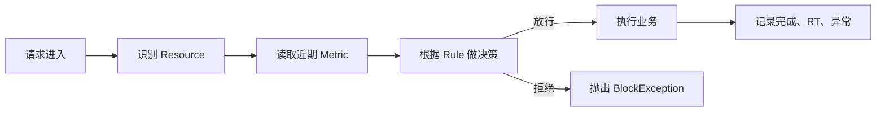
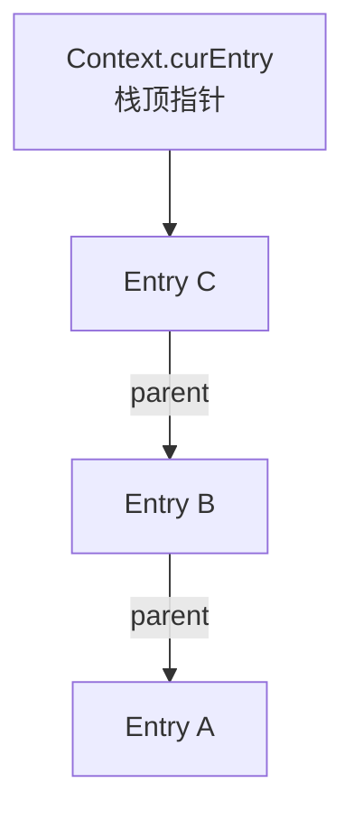
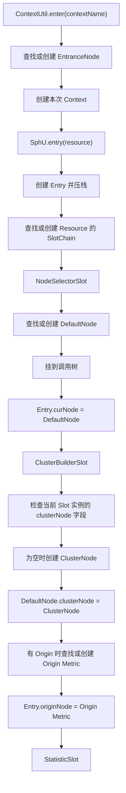
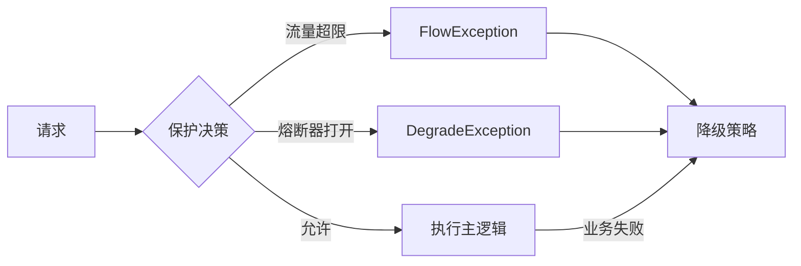

## 1. 背景

阅读 Sentinel 源码时，一个持续出现的困惑是：限流的核心看起来只是“责任链 + 滑动窗口计数器”，为什么实现中又出现了 `Context`、`Entry`、`EntranceNode`、`DefaultNode`、`ClusterNode`、Origin Node，以及多个含义不直观的 Slot？

这篇笔记整理当前阶段的理解，重点回答三个问题：

1. Sentinel 为了哪些功能引入这些概念？
2. 这些对象在一次请求中何时创建、如何关联、各自维护什么？
3. 哪些复杂度来自必要功能，哪些更像历史演进留下的抽象和命名问题？

本文依据当前仓库 `sentinel-core` 源码整理。关于“如果重新设计应该怎样拆分”的内容属于个人评估，不是 Sentinel 官方设计结论。

## 2. 先建立高层模型

Sentinel 可以先理解为一个嵌入应用进程的实时流量决策引擎：



它需要四类基础能力：

| 问题 | Sentinel 中的主要对象 |
| --- | --- |
| 保护谁 | `ResourceWrapper` |
| 表示本次调用 | `Entry` |
| 保存近期运行指标 | 各类 `Node` |
| 根据规则做决策 | 各类 `Rule` 和 `ProcessorSlotChain` |

更准确的简化不是“责任链 + 一个计数器”，而是：

> 责任链 + 多个统计维度的滑动窗口计数器 + 一棵进程内的长期调用关系树。

其中调用树不是普通限流的必要条件，主要服务于 Context 维度统计、链路流控和 Sentinel 自带的树形观测。

## 3. Context 与 Entry：一次调用中的栈

### 3.1 Context 是栈容器，不是完整 Trace

`Context` 通过 `ThreadLocal` 绑定到当前线程，主要保存：

```text
Context
├── name：调用入口分组名称
├── origin：调用方标识
├── entranceNode：该 Context name 对应的长期入口节点
└── curEntry：当前 Entry，也就是栈顶指针
```

关键源码：

- `sentinel-core/src/main/java/com/alibaba/csp/sentinel/context/Context.java`
- `sentinel-core/src/main/java/com/alibaba/csp/sentinel/context/ContextUtil.java`

在典型同步 Web 请求中，可以近似理解为“一次请求一个 Context 对象”。不过，同名 Context 对象会共享同一个 `EntranceNode`。

它与 Trace Context 相似的地方是都能表达嵌套调用；不同之处是 Sentinel Context 没有 `traceId`、`spanId` 和跨进程传播协议，主要用于本地流量治理。

### 3.2 Entry 是一次资源调用

`Entry` 表示某一次受保护调用的生命周期：

```text
进入 Resource
→ 创建 Entry
→ 执行规则检查
→ 执行业务
→ Entry.exit()
```

`CtEntry` 构造时会压栈：

```java
this.parent = context.getCurEntry();
context.setCurEntry(this);
```

退出时恢复父 Entry：

```java
context.setCurEntry(parent);
```

因此：



`Context` 不是栈顶本身，`Context.curEntry` 才是栈顶指针；`Entry.parent` 构成调用栈。

## 4. 先按 Metric 维度理解各种 Node

Sentinel 的 `Node` 接口主要定义 QPS、RT、异常数、并发数等指标读写能力。它更像 `MetricSource`，并不严格表示树节点。

### 4.1 四种统计维度

| 源码称呼 | 实际维度 | 回答的问题 |
| --- | --- | --- |
| `EntranceNode` | `ContextName` | 这类入口的总体流量是多少？ |
| `DefaultNode` | `ContextName × Resource` | 某类入口中的这个资源有多少流量？ |
| `ClusterNode` | `Resource` | 这个资源跨所有 Context 的总流量是多少？ |
| Origin Node | `Resource × Origin` | 某个调用方访问这个资源的流量是多少？ |

其中 Origin Node 没有独立类型，实际只是 `ClusterNode.originCountMap` 中的 `StatisticNode`。

可以把源码命名替换成下面这组脑内别名：

| 源码名称 | 更接近职责的名字 |
| --- | --- |
| `Node` | `MetricSource` |
| `StatisticNode` | `RollingMetrics` |
| `DefaultNode` | `ContextResourceMetrics` / `InvocationTreeNode` |
| `ClusterNode` | `ResourceGlobalMetrics` |
| Origin Node | `CallerMetrics` |
| `EntranceNode` | `ContextGroupRoot` |

### 4.2 “Cluster”不是分布式集群

`ClusterNode` 默认只是当前 JVM 内某个 Resource 的总指标：

```text
DefaultNode(web, queryUser)       80 QPS ──┐
                                          ├── ClusterNode(queryUser) 100 QPS
DefaultNode(scheduler, queryUser) 20 QPS ──┘
```

这里的 Cluster 表示把同一资源在不同 Context 中的指标聚合起来，不是集群限流中的服务器集群。

## 5. Node 的初始化与关联

Node 不是每次请求全部重新创建，而是按不同维度懒创建并长期复用。

### 5.1 生命周期

| 对象 | 创建时机 | 生命周期 |
| --- | --- | --- |
| `Context` | 每次入口调用 | 请求级 |
| `Entry` | 每次 `SphU.entry()` | 单次资源调用 |
| `EntranceNode` | 第一次遇到 Context name | 长期复用 |
| `ProcessorSlotChain` | 第一次遇到 Resource | 长期复用 |
| `DefaultNode` | 第一次遇到 `Resource × ContextName` | 长期复用 |
| `ClusterNode` | 第一次遇到 Resource | 长期复用 |
| Origin `StatisticNode` | 第一次遇到 `Resource × Origin` | 长期复用 |

### 5.2 三层缓存

```text
ContextUtil.contextNameNodeMap
└── ContextName → EntranceNode

CtSph.chainMap
└── Resource → ProcessorSlotChain

Resource 专属 SlotChain
├── NodeSelectorSlot
│   └── ContextName → DefaultNode
└── ClusterBuilderSlot
    └── clusterNode → 当前 Resource 的 ClusterNode
        └── originCountMap
            └── Origin → StatisticNode
```

`NodeSelectorSlot` 内部虽然只用 `ContextName` 作为 Map key，但 Resource 已经隐含在外层的资源专属 Slot Chain 中，因此完整维度仍然是 `Resource × ContextName`。

### 5.3 初始化顺序



需要特别澄清：

- `ClusterBuilderSlot` 处理请求时不是每次从全局 Map 查询 `ClusterNode`，而是先读当前资源专属 Slot 实例的 `clusterNode` 字段。
- 静态 `clusterNodeMap` 主要是全局索引，供其他组件按 Resource 主动查询。
- `DefaultNode` 创建时 `clusterNode` 还是 `null`，在后续 `ClusterBuilderSlot` 中才绑定。
- `StatisticSlot` 排在绑定之后，因此能够通过 `DefaultNode` 级联更新 `ClusterNode`。这也是 Slot 间的隐式顺序依赖。

## 6. 调用树如何构建

调用树通过 Entry 栈推导，而不是通过 Trace 数据生成。

### 6.1 构树规则

`NodeSelectorSlot` 创建 `DefaultNode` 后执行：

```java
context.getLastNode().addChild(node);
```

`getLastNode()` 的名字容易误解，它实际返回：

```text
当前 Entry 有父 Entry
→ 返回父 Entry.curNode

当前 Entry 没有父 Entry
→ 返回 Context.entranceNode
```

更准确的名字应当是：

```java
getParentNodeOfCurrentEntry()
```

假设调用为：

```text
A → B → C
```

Entry 栈：

```text
Context.curEntry
└── Entry C
    └── parent → Entry B
        └── parent → Entry A
```

Node 树：

```text
EntranceNode
└── DefaultNode A
    └── DefaultNode B
        └── DefaultNode C
```

第一个 Entry 不是 `EntranceNode`。第一个 Entry 对应的仍然是 `DefaultNode`，只是因为它没有父 Entry，所以挂在 `EntranceNode` 下面。

### 6.2 它不等同于精确 Trace

这棵树按 `Resource × ContextName` 长期复用，不是每个请求单独创建。假设第一次出现：

```text
A → B
```

后来又出现：

```text
C → B
```

同一个 Context name 下的 B 通常复用原来的 `DefaultNode`，不会像 Trace 一样为第二条路径创建新的 Span Node。因此它更接近长期统计关系树，而不是每次请求的精确调用树。

个人评估：如果系统已经使用专业 Trace，并且不需要 Sentinel 的链路流控和 `/tree` 观测，这棵调用树的价值比较有限。

## 7. StatisticSlot 在什么时间维护 Metric

`StatisticSlot` 分两个时间点维护指标：

```text
entry：记录准入结果
exit：记录执行结果
```

### 7.1 entry 阶段

它先调用 `fireEntry()` 执行后续规则 Slot：

```java
try {
    fireEntry(...);

    node.increaseThreadNum();
    node.addPassRequest(count);
} catch (BlockException e) {
    node.increaseBlockQps(count);
    throw e;
}
```

因此：

| 结果 | 更新 |
| --- | --- |
| 后续规则全部通过 | `pass += 1`，`thread += 1` |
| 后续规则抛出 `BlockException` | `block += 1` |

`pass` 表示已经被 Sentinel 放行，不表示业务成功完成。

### 7.2 exit 阶段

业务结束并调用 `Entry.exit()` 时：

```text
completed += 1
RT += 本次耗时
thread -= 1
存在业务异常时 exception += 1
```

源码中的 `success` 更接近 completed：即使业务异常，也会记录完成数，同时增加 exception。

### 7.3 一次调用会更新哪些 Metric

假设：

```text
ContextName = web
Resource = queryUser
Origin = mobile-app
EntryType = IN
```

一次放行会更新：

```text
DefaultNode(web, queryUser)
ClusterNode(queryUser)
OriginMetrics(queryUser, mobile-app)
Constants.ENTRY_NODE
```

其中：

- `DefaultNode` 自身更新后级联更新 `ClusterNode`。
- Origin Metric 由 `StatisticSlot` 单独更新。
- `Constants.ENTRY_NODE` 只针对 `EntryType.IN` 更新。

## 8. Constants.ENTRY_NODE

`Constants.ENTRY_NODE` 是整个 JVM 所有入口流量共享的指标：

```java
new ClusterNode("__total_inbound_traffic__", ...)
```

它的维度不是 Resource，而是：

```text
应用内所有 EntryType.IN Resource 的总和
```

例如：

```text
GET:/users       100 QPS
POST:/orders      50 QPS
GET:/products    200 QPS
```

则：

```text
Constants.ENTRY_NODE = 350 QPS
```

它主要供 `SystemRuleManager` 检查应用整体入口 QPS、并发数、平均 RT 等系统保护指标。

它与 `EntranceNode` 不同：

| 对象 | 维度 |
| --- | --- |
| `EntranceNode` | 一个 Context name |
| 普通 `ClusterNode` | 一个 Resource |
| `Constants.ENTRY_NODE` | 应用内全部 `EntryType.IN` Resource |

更合适的名字是 `GlobalInboundMetrics`。

## 9. 默认 Slot 的真实职责与反直觉命名

默认 Slot Chain 可以分成两组：

```text
指标准备与观察
├── NodeSelectorSlot
├── ClusterBuilderSlot
├── LogSlot
└── StatisticSlot

治理决策
├── AuthoritySlot
├── SystemSlot
├── FlowSlot
├── DegradeSlot
└── DefaultCircuitBreakerSlot
```

| 原名 | 实际职责 | 更易懂的名字 |
| --- | --- | --- |
| `NodeSelectorSlot` | 解析或创建 `DefaultNode`，构树并绑定 Entry | `ContextMetricResolver` |
| `ClusterBuilderSlot` | 创建资源总 Metric、管理 Origin Metric 并完成绑定 | `ResourceMetricBinder` |
| `LogSlot` | 捕获并记录后续 Slot 的拒绝异常 | `RejectionLoggingSlot` |
| `StatisticSlot` | 维护准入和完成阶段指标 | `MetricRecordingSlot` |
| `AuthoritySlot` | 基于 Origin 做黑白名单检查 | `OriginAccessControlSlot` |
| `SystemSlot` | 根据应用整体指标做过载保护 | `SystemProtectionSlot` |
| `FlowSlot` | 执行流控、限流和流量整形 | `FlowControlSlot` |
| `DegradeSlot` | 执行显式配置的熔断器 | `ConfiguredCircuitBreakerSlot` |
| `DefaultCircuitBreakerSlot` | 执行 `resource="*"` 的通配默认熔断规则 | `WildcardCircuitBreakerSlot` |

`NodeSelectorSlot` 中的 Selector 只体现在：

```java
map.get(context.getName())
```

但它实际还负责创建、缓存、构树和绑定。

`ClusterBuilderSlot` 中的 Cluster 不是分布式集群，Builder 也没有覆盖其绑定和 Origin Registry 职责。

`DegradeSlot` 实际执行熔断，不负责返回缓存、默认值或备用服务。

## 10. 限流、熔断与降级

限流和熔断属于同一个决策层面：

```text
本次请求是否允许执行主逻辑？
```

但判断依据不同：

| 机制 | 关注点 | 典型拒绝异常 |
| --- | --- | --- |
| 限流 | 当前流量是否超过容量 | `FlowException` |
| 熔断 | 被调用资源近期是否不健康 | `DegradeException` |
| 调用方控制 | Origin 是否允许访问 | `AuthorityException` |
| 系统保护 | 应用整体是否过载 | `SystemBlockException` |

降级属于另一个正交层面：

```text
主逻辑不能执行后，返回什么？
```

例如：

- 返回缓存；
- 返回默认值；
- 调用备用服务；
- 只返回部分数据；
- 明确返回系统繁忙。

限流和熔断都可以触发降级：



Sentinel 把熔断相关类型命名成 `DegradeRule`、`DegradeSlot`、`DegradeException`，容易把熔断机制和降级策略混在一起。更准确的命名分别应是 `CircuitBreakerRule`、`CircuitBreakerSlot` 和 `CircuitBreakerOpenException`。

## 11. BlockException 异常树

```text
Exception
└── BlockException
    ├── FlowException
    ├── DegradeException
    ├── AuthorityException
    ├── SystemBlockException
    └── ParamFlowException
```

`BlockException` 的统一语义是：

> 请求在进入业务代码前，被 Sentinel 的治理规则拒绝。

它不属于业务异常。`StatisticSlot` 会把它计入 block，而不是 exception。

`BlockException.fillInStackTrace()` 直接返回自身，不生成完整调用栈，适用于高频拒绝场景，避免大量构造堆栈的成本。

## 12. DefaultCircuitBreakerSlot 与默认规则缓存

### 12.1 它不是 DegradeSlot 的默认实现

两个 Slot 处理不同规则来源：

```text
DegradeSlot
→ 具体 Resource 的显式熔断规则

DefaultCircuitBreakerSlot
→ resource="*" 的通配默认熔断规则
```

显式规则优先。如果 `DegradeRuleManager.hasConfig(resource)` 为 true，`DefaultCircuitBreakerSlot` 会跳过。

源码历史显示，这项能力由 2022 年的提交 `Add default circuit breaker rule support (#2232)` 单独加入。因此没有对称的 `DefaultFlowSlot`：这是后续增加的一项熔断功能，不是 Slot 架构中天然存在的“默认实现”层次。

### 12.2 规则从哪里来

默认规则通过以下入口加载：

```java
DefaultCircuitBreakerRuleManager.loadRules(rules);
```

或注册动态 Property：

```java
DefaultCircuitBreakerRuleManager.register2Property(property);
```

Sentinel Core 默认不会凭空生成一组默认熔断阈值；没有上层主动加载时，这个 Slot 不生效。

### 12.3 缓存与更新

运行时缓存结构：

```text
ResourceName → List<CircuitBreaker>
```

更新链路：

```text
loadRules(newRules)
→ SentinelProperty.updateValue()
→ PropertyListener.configUpdate()
→ reloadFrom(newRules)
→ 重建并整体替换 circuitBreakers Map
```

已经出现过的 Resource 会在更新时重建；尚未出现的 Resource 在第一次访问时按照最新规则懒创建；规则清空时 rules 和缓存全部清空。

### 12.4 当前实现中值得注意的边界

源码似乎希望复用规则未变化的旧熔断器，以保留状态：

```java
getExistingSameCbOrNew(rule)
```

但该方法使用 `rule.getResource()` 查询缓存。默认规则的 Resource 固定为 `"*"`，而缓存通常以实际 Resource name 为 key。因此按当前代码看，只要默认规则集合发生变化，已缓存资源的 CircuitBreaker 基本会重新创建，原状态和统计窗口会被重置。

另外，`DynamicSentinelProperty` 使用 `oldValue.equals(newValue)` 判断变化。如果原地修改同一个 List 或 Rule 对象再调用 `loadRules()`，更新可能无法触发。更安全的方式是传入新的规则快照。

以上两点是基于当前源码的实现判断，尚未通过专门的运行实验验证。

## 13. 当前设计评估

以下是个人评估，不是源码事实。

### 13.1 调用树可以与流控 Metric 解耦

如果系统已经使用 Trace，并且不需要 Sentinel 的链路流控，可以考虑让 Trace 负责调用拓扑，Sentinel 只保留本地实时 Metric：

```text
Trace
→ 每次请求的精确调用拓扑

MetricRegistry
→ 本地实时滑动窗口

PolicyChain
→ 限流、熔断、授权和系统保护
```

### 13.2 Metric 不应通过 Node 层级表达

逻辑上可以统一成：

```text
(Resource, GLOBAL)
(Resource, CONTEXT, ContextName)
(Resource, ORIGIN, Origin)
(APPLICATION, INBOUND)
```

底层仍可按 Resource 分组存储：

```java
class ResourceMetricSet {
    RollingMetrics global;
    Map<String, RollingMetrics> contextMetrics;
    Map<String, RollingMetrics> originMetrics;
}
```

这里的嵌套只是索引方式，不表示业务父子关系。

### 13.3 Metric Registry、Recorder 和 Policy Chain 应分开

更清楚的职责划分：

```text
MetricRegistry
→ 解析或创建各维度 Metric

MetricRecorder
→ onPass / onBlock / onComplete

PolicyChain
→ 根据 Metric 和 Rule 做决策

InvocationContext
→ 保存本次调用的 Resource、Origin 和生命周期
```

这样可以避免 `NodeSelectorSlot → ClusterBuilderSlot → StatisticSlot` 之间的隐式初始化顺序。

### 13.4 默认规则不必增加新 Slot

`DegradeSlot` 和 `DefaultCircuitBreakerSlot` 可以统一成一个 `CircuitBreakerSlot`，由 Rule Registry 处理优先级：

```text
具体 Resource 规则
→ 存在则使用

否则使用 "*" 通配规则
→ 被排除则不使用
```

默认规则属于规则解析问题，不必提升成新的处理阶段。

## 14. 复习索引

### 14.1 四个核心对象

```text
Resource：保护谁
Entry：本次调用
Metric/Node：近期发生了什么
Slot + Rule：是否允许执行
```

### 14.2 Node 维度

```text
EntranceNode = ContextName
DefaultNode = ContextName × Resource
ClusterNode = Resource
OriginNode = Origin × Resource
Constants.ENTRY_NODE = Application × EntryType.IN
```

### 14.3 两种关联

```text
EntranceNode ──child──▶ DefaultNode
```

这是调用树关系。

```text
DefaultNode ──aggregate──▶ ClusterNode
```

这是指标级联关系，不是树的父子关系。

### 14.4 构树规则

```text
当前 Entry 有父 Entry
→ 当前 DefaultNode 挂到 parent Entry.curNode 下

当前 Entry 没有父 Entry
→ 当前 DefaultNode 挂到 Context.entranceNode 下
```

### 14.5 指标更新时间

```text
entry：
pass / block / thread+

exit：
completed / RT / exception / thread-
```

### 14.6 易混命名

```text
ClusterNode ≠ 分布式集群节点
DegradeSlot = 熔断检查，不负责降级返回
DefaultCircuitBreakerSlot = 通配规则 Slot，不是默认实现
NodeSelectorSlot = 解析、创建、构树和绑定，不只是选择
Context.getLastNode() = 当前 Entry 的父 Node
```

## 15. 依据与下一步

本笔记主要依据以下源码：

- `sentinel-core/src/main/java/com/alibaba/csp/sentinel/context/Context.java`
- `sentinel-core/src/main/java/com/alibaba/csp/sentinel/context/ContextUtil.java`
- `sentinel-core/src/main/java/com/alibaba/csp/sentinel/CtEntry.java`
- `sentinel-core/src/main/java/com/alibaba/csp/sentinel/CtSph.java`
- `sentinel-core/src/main/java/com/alibaba/csp/sentinel/node/`
- `sentinel-core/src/main/java/com/alibaba/csp/sentinel/slots/nodeselector/NodeSelectorSlot.java`
- `sentinel-core/src/main/java/com/alibaba/csp/sentinel/slots/clusterbuilder/ClusterBuilderSlot.java`
- `sentinel-core/src/main/java/com/alibaba/csp/sentinel/slots/statistic/StatisticSlot.java`
- `sentinel-core/src/main/java/com/alibaba/csp/sentinel/slots/block/`
- `sentinel-core/src/main/java/com/alibaba/csp/sentinel/slots/system/SystemRuleManager.java`

下一步适合沿一条最小调用链继续验证：

```text
SphU.entry("createOrder")
→ CtSph.entryWithPriority()
→ NodeSelectorSlot
→ ClusterBuilderSlot
→ StatisticSlot
→ FlowSlot
→ Entry.exit()
```

重点观察：

1. 第 101 个请求在 `FlowRule(QPS=100)` 下具体读取哪个 Metric；
2. `DefaultNode` 与 `ClusterNode` 的滑动窗口如何更新；
3. `Entry.exit()` 如何把业务异常传递给熔断器；
4. 默认熔断规则更新后，旧 CircuitBreaker 状态是否确实被重置。
